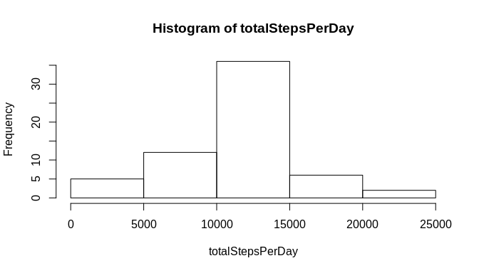
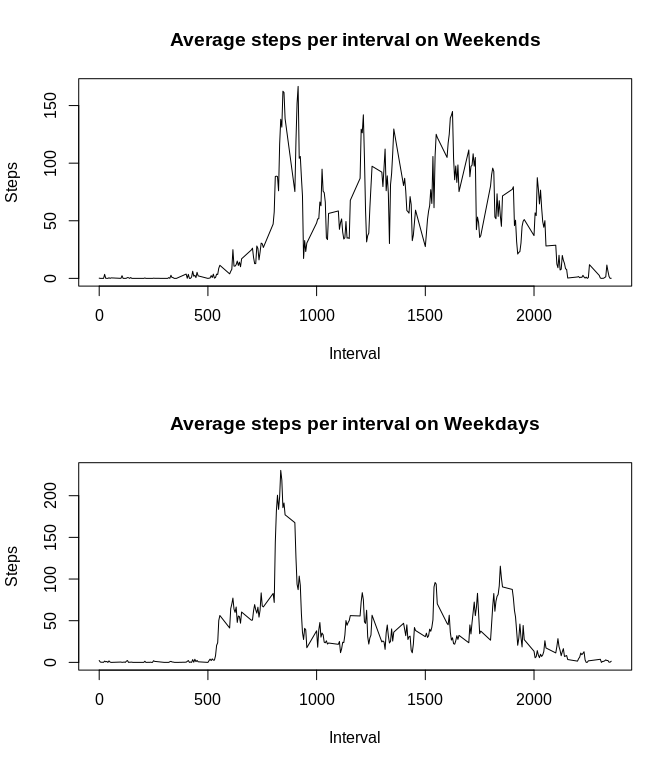

## 1. Loading and preprocessing the data


```r
if (!file.exists("activity.csv")) {
  if (!file.exists("activity.zip")) {
    download.file(
      "https://d396qusza40orc.cloudfront.net/repdata%2Fdata%2Factivity.zip",
      "activity.zip")
  }
  unzip("activity.zip")
}
activity <- read.csv("activity.csv", colClasses=c("numeric","Date","numeric"))
```


## 2. What is mean total number of steps taken per day?

Make a histogram of the total number of steps taken each day.


```r
totalStepsPerDay <- tapply(X=activity$steps, 
                           INDEX=activity$date, 
                           FUN=sum, na.rm=TRUE)
hist(totalStepsPerDay)
```

<!-- -->

Calculate and report the median and mean steps per day.


```r
mean(totalStepsPerDay, na.rm=TRUE)
```

```
## [1] 9354.23
```

```r
median(totalStepsPerDay, na.rm=TRUE)
```

```
## [1] 10395
```


## 3. What is the average daily activity pattern?

Make a time-series plot of the 5-minute interval and average number of steps 
taken, averaged across all days.


```r
aveStepsPerInterval <- tapply(X=activity$steps,
                              INDEX=activity$interval,
                              FUN=mean, na.rm=TRUE)
plot(type="l",
     x=names(aveStepsPerInterval), xlab="Interval",
     y=aveStepsPerInterval,        ylab="Steps",
     main="Average number of steps per 5-minute interval")
```

<!-- -->

Which 5-minute interval, on average across all the days in the dataset, contains 
the maximum number of steps?


```r
names(which.max(aveStepsPerInterval))
```

```
## [1] "835"
```


## 4. Imputing missing values

Calculate and report the total number of missing values in the dataset 
(i.e. the total number of rows with NAs).


```r
sum(!complete.cases(activity))
```

```
## [1] 2304
```

Devise a strategy for filling in all of the missing values in the dataset. 

- Strategy: use the mean for that 5-minute interval across all days

Create a new dataset that is equal to the original dataset 
but with the missing data filled in.

```r
new_activity <- data.frame(steps    = activity$steps,
                           date     = activity$date,
                           interval = activity$interval)

missing_rows      <- is.na(new_activity$steps)
missing_intervals <- as.character(new_activity[missing_rows, ]$interval)

new_activity[missing_rows, ]$steps <- aveStepsPerInterval[ missing_intervals ]
```

Make a histogram of the total number of steps taken each day.


```r
totalStepsPerDay <- tapply(X=new_activity$steps, 
                      INDEX=new_activity$date,
                      FUN=sum, na.rm=TRUE)
hist(totalStepsPerDay)
```

<!-- -->

Calculate and report the mean and median total number of steps taken per day. 


```r
mean(totalStepsPerDay, na.rm=TRUE)
```

```
## [1] 10766.19
```

```r
median(totalStepsPerDay, na.rm=TRUE)
```

```
## [1] 10766.19
```

Do these values differ from the estimates from the first part of the assignment?

- Yes, the mean and median are higher than the estimates from the first part.
  
  
What is the impact of imputing missing data on the estimates 
of the total daily number of steps?

- Imputing missing data inflated the total daily number of steps.
- The number of days with 10000-15000 recorded steps jumped from 25 to 35.


## 5. Are there differences in activity patterns between weekdays and weekends?

Create a new factor variable in the dataset with two levels - “weekday” and 
“weekend” - indicating whether a given date is a weekday or weekend day.

```r
new_activity$w <-
  factor(weekdays(new_activity$date) %in% c("Saturday", "Sunday"),
         levels=c(TRUE, FALSE),
         labels=c("weekend", "weekday"))
```

Make a panel plot containing a time series plot (i.e. type="l") of the 5-minute 
interval (x-axis) and the average number of steps taken, averaged across all
weekday days or weekend days (y-axis). 


```r
aveStepsW <- data.frame(
                tapply(X=new_activity$steps,
                       INDEX=list(new_activity$interval, new_activity$w),
                       FUN=mean, na.rm=TRUE))
par(mfrow=c(2,1))

plot(type="l",
     x=rownames(aveStepsW), xlab="Interval",
     y=aveStepsW$weekend,   ylab="Steps",
     main="Average steps per interval on Weekends")

plot(type="l",
     x=rownames(aveStepsW), xlab="Interval",
     y=aveStepsW$weekday,   ylab="Steps",
     main="Average steps per interval on Weekdays")
```

<!-- -->
